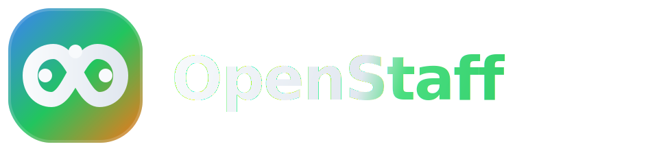

# 👥 OpenStaff — AI Staff Operations

<p align="center">
  <picture>
    <source media="(prefers-color-scheme: light)" srcset="build/logo-wordmark.svg">
    
  </picture>
</p>

<p align="center">
  <strong>Hire your AI staff. Let them work 24/7.</strong>
</p>

<p align="center">
  <a href="https://github.com/KoreanThinker/openstaff/actions/workflows/ci.yml?branch=main"></a>
  <a href="https://github.com/KoreanThinker/openstaff/releases"></a>
  <a href="LICENSE"></a>
</p>

**OpenStaff** is a local-first desktop app for operating multiple AI coding agents like a real team.
Each Staff runs a continuous loop: **Gather → Execute → Evaluate**.
You define each role in plain language, attach skills, and monitor outcomes from one dashboard.

[Releases](https://github.com/KoreanThinker/openstaff/releases) · [Product Docs](docs/PRD.md) · [Security](SECURITY.md)

## Install (recommended)

Download the latest app package from [Releases](https://github.com/KoreanThinker/openstaff/releases).

- macOS: `.dmg`
- Linux: `.AppImage` / `.deb`

## Quick start (from source)

Runtime: **Node >= 22**, **pnpm >= 9**

```bash
git clone https://github.com/KoreanThinker/openstaff.git
cd openstaff
pnpm install
pnpm dev
```

Build packages:

```bash
pnpm build:mac
pnpm build:linux
```

## Highlights

- **Infinite operations loop**: every Staff continuously runs Gather → Execute → Evaluate.
- **Multi-staff orchestration**: run specialized Staff in parallel for different business functions.
- **Live monitoring**: track cycles, token usage, costs, logs, and KPIs in real time.
- **Skill system**: install reusable `SKILL.md` skills from registry or local folders.
- **Remote dashboard access**: connect securely through Ngrok with password protection.
- **Local-first storage**: data stays in your machine under `~/.openstaff`.

## Security defaults (remote access)

- Remote access is **off** by default.
- Ngrok tunnel requires both API key and auth password.
- Sensitive values are encrypted in local config (`electron-store` + `safeStorage`).

Full details: [SECURITY.md](SECURITY.md)

## How it works (short)

```text
┌──────────────────────────────────────────────┐
│                OpenStaff App                 │
│                                              │
│  React UI  <-->  Main Process API/WebSocket  │
│                      │                       │
│                 Staff Manager                │
│                      │                       │
│          Agent Drivers (Claude Code)         │
└──────────────────────────────────────────────┘
                       │
                 ~/.openstaff/
```

## Star History

[](https://www.star-history.com/#KoreanThinker/openstaff&Date)

## License

[MIT](LICENSE)
